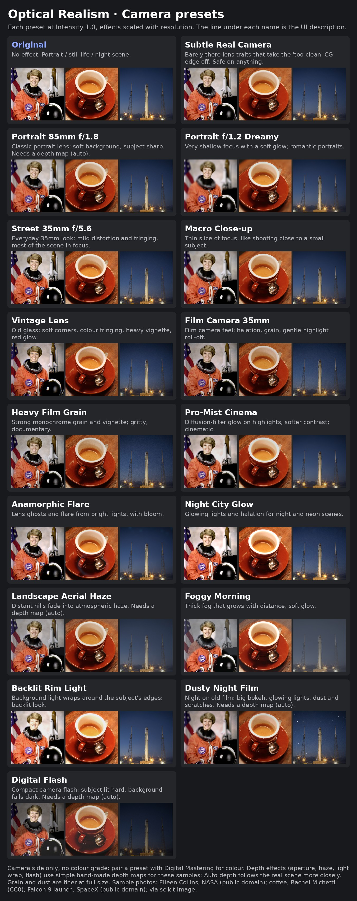

# Stable Diffusion Optical Realism Adaption for Forge/reForge/Neo

Makes a generated image look photographed: lens traits, depth of field, light
scatter, haze and film character. Applied to every image after the inpaint
composite. Works on Forge, reForge and Forge Classic (Neo).

Adapted from [ComfyUI-Optical-Realism](https://github.com/skatardude10/ComfyUI-Optical-Realism)
by skatardude10.



## Layout

```
[x] Optical Realism
    [x] Auto depth map  [Depth model v]  (MoGe-3 refine steps)  [x] Scale with resolution
    (your depth map, when Auto is off)
    [All] [Everyday] [Lens] [Film] [Light] [Night] [Retro]   <- preset groups
    ‹ [icon] [icon] [icon] [icon] [icon] ... ›               <- preset carousel
    description of the picked preset          [Reset]
    [▦ Preset reference]             <- click to unfold the picture above
    Intensity  ----o-----            <- scales every effect; 0 = off, 2 = double
    [ Camera & Lens | Atmosphere | Depth of Field | Optical Effects | Film Emulation | Retro Video | Blur ]
      one-line hint
      [x] Enable ...                 <- one per tab
      the controls
```

Seven tabs, each with its **Enable** box (Depth of Field also holds Tilt-shift, with its own); a freshly ticked tab starts from the
original node's values. 26 camera presets in six groups; a preset ticks the tabs it uses and
unticks the rest, and never touches Intensity or the depth settings.

**Picking a preset**: a carousel of small icons, one per preset, each the preset on a sample picture with a short word mark and its group. The chips above it filter by group, the arrows (or a sideways scroll) move along, a click applies the preset. Hover a card for its description.

**Preset reference** unfolds a picture of every preset on three sample photos
(portrait, still life, night scene). Scroll inside the box, or click the
picture to open it full size in a new tab. Click the button again to fold it.

## Auto Color Corrector, Optical Realism and Digital Mastering

Three extensions split the work the way a photo is made, and run in this
order:

| 1. [Auto Color Corrector](https://github.com/sca-285/sd-forge-auto-color-corrector) | 2. [Optical Realism](https://github.com/sca-285/sd-forge-optical-realism) | 3. [Digital Mastering](https://github.com/sca-285/sd-webui-digital-mastering) |
|---|---|---|
| **Correction**, automatic: measures the image and fixes only what is off (colour cast, black and white points, exposure, flat or harsh contrast, dull colour, JPEG blocks, noise, a tilted horizon), or matches a reference picture | **The camera**: lens geometry, vignette, purple fringing, depth of field and bokeh, tilt-shift, blur, bloom, flare, anamorphic streak, star filter, god rays, halation, light wrap, flash, haze, grain, dust, scratches, date stamp, highlight roll-off, retro video | **The grade**, by hand or by preset: exposure, contrast, white balance, saturation, vibrance, split toning, CDL, LUT, selective colour, clarity, sharpen, overlays, HSL, colour wheels, tone curves, black & white, dehaze, skin smoothing, local light, subtitles, anti-banding |

No two of them do the same job. Auto Color Corrector and Digital Mastering
both touch exposure and white balance, but for opposite ends: the corrector
brings a faulty picture back to neutral by itself and leaves a sound one
alone; Digital Mastering moves a picture away from neutral, on purpose, by
the amount you set. Correct first, then shoot, then grade.

Optical Realism and Digital Mastering presets each cover only their own
side, so a look is one preset from each. Pairs that go together:

| Optical Realism | Digital Mastering |
|---|---|
| Subtle Real Camera | Natural: Clean Polish |
| Portrait 85mm f/1.8 | Portrait: Studio Skin |
| Portrait f/1.2 Dreamy | Portrait: Soft Glamour |
| Street 35mm f/5.6 | Natural: Vivid Pop or Film: Cool Slide Stock |
| Macro Close-up | Natural: HDR Detail |
| Vintage Lens | Film: Faded Vintage or Film: Instant Photo |
| Film Camera 35mm | Film: Portra Golden or Film: Olive Signature |
| Heavy Film Grain | B&W: Classic Silver or B&W: Hard Noir |
| Pro-Mist Cinema | Cinema: Teal & Orange |
| Anamorphic Flare | Cinema: Blockbuster |
| Night City Glow | Mood: Cyberpunk Neon or Film: Red Neon Night |
| Landscape Aerial Haze | Mood: Golden Hour |
| Foggy Morning | Natural: Soft Matte or Mood: Blue Hour |
| Backlit Rim Light | Mood: Golden Hour |
| Dusty Night Film | Cinema: Dusty Night or Cinema: Moody Dark |
| Digital Flash | Mood: Flash Snapshot |

## Lens character, filters and retro video

| Where | Effect | What it does |
|---|---|---|
| Camera & Lens | **Purple fringing** | A violet edge just outside very bright areas, as on fast or old lenses |
| Atmosphere | **Haze colour** | Blue-grey (as before), warm morning, white mist, smoke or dusk violet |
| Depth of Field | **Bokeh shape** | Round, oval (anamorphic: taller than wide) or hexagon (6 blades) |
| Depth of Field | **Bokeh rim** | Bright-edged discs, like a soap-bubble (Trioplan) lens |
| Depth of Field | **Swirl / cat-eye** | The background swirls round the centre, discs turn cat-eye at the edges (Helios) |
| Depth of Field | **Tilt-shift** | A band of focus with blur growing away from it: the miniature look |
| Optical Effects | **Anamorphic streak** | A long horizontal flare line through each bright light, blue by default |
| Optical Effects | **Star filter** | 4, 6 or 8-point rays from the brightest points (cross-screen filter) |
| Optical Effects | **God rays** | Light shafts from the strongest light, found automatically or placed by hand; far bright areas feed them most (uses the depth map) |
| Retro Video | **VHS** | Colour smeared and shifted against a softer picture, tape noise, tracking band |
| Retro Video | **CRT scanlines** | Scanlines, picture lifted to keep its brightness |
| Retro Video | **Glitch** | Torn slices and split colour; same seed, same glitch |

Retro video runs last, over everything else: the tape or the screen records the
finished picture. The streak, star filter and god rays are worked out at reduced
resolution, so large frames stay fast.

## Notes

- Depth of field, haze, light wrap, flash, god rays and depth-aware blur read a depth map.
  Everything else runs without one. The depth model is parked in system RAM
  between jobs. Choose it under **Depth model**:

  | Model | Size | Notes |
  |---|---|---|
  | Depth Anything V2 Small / Base / Large | 25M / 98M / 335M | fast; Large is the default |
  | MoGe-3 Large (vitl) | 370M | cleaner subject edges and depth layers (about 1 GB VRAM) |
  | MoGe-3 Giant (vitg) | 1.25B | most accurate, heaviest (about 3 GB VRAM) |

  Or turn Auto off and upload your own map (white = near).
- **MoGe-3** ([Microsoft](https://github.com/microsoft/MoGe)) downloads from
  Hugging Face on first use, or put the checkpoint in `models/MoGe/` as
  `moge-3-vitl.pt` / `moge-3-vitg.pt`. Its model code ships with the extension,
  so nothing extra is installed. **MoGe-3 refine steps** (default 3, shown
  when a MoGe-3 model is picked) sharpen edges such as hair and leaves; they
  need the optional `flex_gemm` package and a CUDA GPU. Without it MoGe-3 runs
  with the refiner off and says so once in the console. To enable it, from the
  WebUI's Python environment:

  ```
  pip install triton-windows    # Windows only; pick the version that matches your torch
  pip install --no-deps git+https://github.com/JeffreyXiang/FlexGEMM.git
  ```
- Depth-aware Extra blur blurs the far parts and keeps the subject sharp.
- Bloom, flare, pro-mist, light-wrap and soft-corner blurs run as two 1-D
  passes, and a large depth-of-field disk runs at reduced resolution, so large
  images stay fast.
- Grain and dust are seeded from the image's seed: the same seed gives the
  same grain and the same specks.
- **Flash** (Optical Effects) is an on-camera flash: near things are lit, the
  background falls dark with distance. **Flash reach** sets how far it carries.
- **Dust** and **Scratches** (Film Emulation) print as light marks, most
  visible in dark areas.
- **Date stamp** (Film Emulation, folded under *Date stamp*) burns an orange
  LED date into a corner or along the left edge. Empty text = today's date in
  the chosen format; it draws digits and `' / . - :` only. Off by default, also
  in the *Digital Flash* preset. Intensity does not dim it.
- Temperature and tint moved to Digital Mastering; when an older image is
  pasted they are ignored. **Grain size** (Film Emulation) came the other way.
- With Auto depth off and no map supplied, only the depth effects are skipped.
- *Extra blur* needs `blurgenerator` (installed by `install.py`).

## X/Y/Z plot

Axes for the X/Y/Z plot script, under `[OR]`: Preset, Intensity, Aperture,
Bloom, Halation, Grain, Flash, Haze, Bokeh shape, Anamorphic streak, Star
filter, God rays, Tilt-shift blur, VHS. A cell that sets any of them switches the
extension on for that cell, and an axis ticks the tab it belongs to; a Preset
axis is applied first, then the other axes on top. Pair `[OR] Preset` with
Digital Mastering's `[DM] Preset` to compare camera and grade combinations.

## PNG info

One `Optical Realism` entry with the non-default values; Send to / Paste
restores it. The older `Geometry(...) | DOF(...)` format still pastes.

## Files

```
scripts/optical_realism.py   UI + host hooks
optical_realism_core.py      the optics (pure torch) and the depth model
lib_or/controls.py           every control, declared once (UI, presets, PNG info)
lib_or/presets.py            the 26 camera presets and their groups
lib_or/layout.py             tabs and guide texts
lib_or/blur.py               Extra blur via blurgenerator
lib_or/depth_moge.py         MoGe-3 depth maps
lib_or/moge/                 MoGe-3 model code (vendored, see its README)
lib_or/reference.py          the folded preset reference
lib_or/carousel.py           the preset carousel (HTML)
javascript/or_carousel.js    the preset carousel (clicks, filter, scroll)
preset_icons/                the preset icons, one picture per preset
lib_or/stamp.py              the seven-segment date stamp
lib_or/xyz.py                X/Y/Z plot axes
lib_or/fx.py                 bokeh shapes, streak, star filter, god rays, fringing, tilt-shift, retro video
preset_reference.jpg         the preset reference picture
style.css                    reference box, preset carousel
```

## Credits

- [ComfyUI-Optical-Realism](https://github.com/skatardude10/ComfyUI-Optical-Realism)
  by skatardude10, the node this extension is adapted from.
- [Depth Anything V2](https://github.com/DepthAnything/Depth-Anything-V2) and
  [MoGe-3](https://github.com/microsoft/MoGe) (Microsoft, MIT; DINOv2 by Meta AI,
  Apache-2.0) for depth maps; [FlexGEMM](https://github.com/JeffreyXiang/FlexGEMM)
  (MIT) for the optional MoGe-3 refiner;
  [blurgenerator](https://pypi.org/project/blurgenerator/) for Extra blur.
- Sample photos in `preset_reference.jpg`, from scikit-image's sample data:
  Eileen Collins by NASA (public domain), coffee cup by Rachel Michetti (CC0),
  Falcon 9 launch by SpaceX (public domain).
- Preset icons (`preset_icons/`): photos from the Open Images dataset, by Flickr
  photographers under CC BY 2.0 (each author and source listed in
  `preset_icons/CREDITS.md`), cropped, with the preset applied and lettering in
  Bebas Neue (SIL Open Font License 1.1; only the rendered pictures are shipped).

Thanks also to **Claude**, for help building this
extension.

## License

The original node does not state a licence yet, so none is given here for
now; see `NOTICE.md`.
